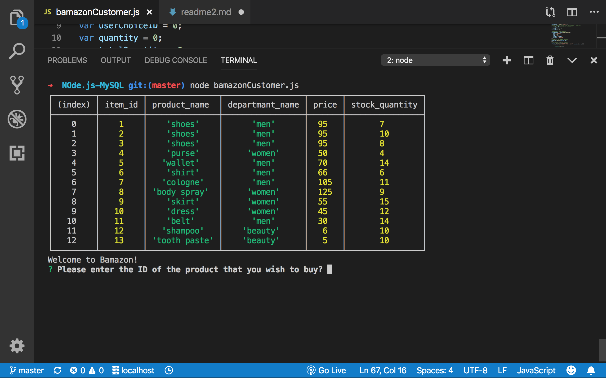
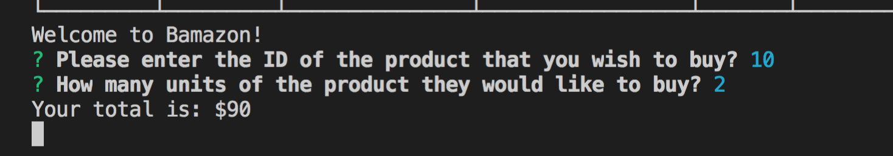

# Bamazon

##Developer - Eva Khan (2019)
### Bamazon is a simple command line application that creates a storefront using npm MySQL backend database, and npm Inquirer for prompts for the customer. 

#Database Setup and Required package

### In order to run this application, user has to set up MySQL database in their machine. Then the user will be able to create Bamazon databese with the code found in schema.sql and products table code is in seeds.sql. The user will aslo has to create thire own password for database for connection.

### Need to install inquirer and MySQL
    ```install
    important installation node modules
    npm install MySQL
    npm install Inquirer
    ```

# Customer Interface

### The customer interface allows customer to view the inventory of the store products table with item IDs, the departname name that the item is in and the price. The Customer will be asked to select the producd with the item ID. Then customer will be asked the quantity that they want. Customer will see the total quantity os the prduct and thier total cost. If the quantiy of an item is more then the inventory, the customer will be notified of the insufficient inventory.

## The CLI commands to run the application

``` commands
node filename
Questions will show 
User can input their item ID 
User can input the number of Quantity
```





#Database Update

### Once the customer order has been procced, the quantity of the items will be decucted from the procudts table and show the current inventory. 

```See updated table
go to seeds.sql file
highlight and run the below code 
USE bamazonDB;
SELECT * FROM products;
```

